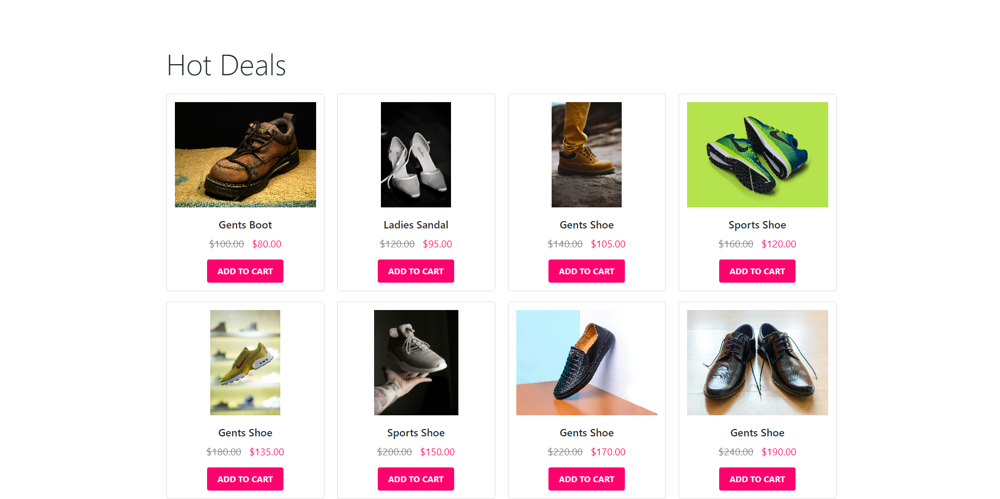

# BechaKena - E-Commerce and Auction Platform

## Overview

BechaKena is a dynamic e-commerce platform that integrates auction capabilities with traditional e-commerce functionalities. Users can place bids, win auctions, and manage their orders all within a sleek, modern interface. This application is built using a combination of PHP, HTML, CSS, and JavaScript, with a focus on providing a seamless user experience.

## Features

- **User Authentication**: Secure login and registration system.
- **Profile Management**: Users can update their personal information and profile picture.
- **Auction and Bidding**: Users can participate in auctions and view their bidding history.
- **Order Management**: Users can view and manage their orders.
- **Dashboard**: Provides users with insights into their bids, winning bids, and credits.

## Technologies Used

- **Frontend**:
  - CSS

- **Backend**:
  - PHP
  - MySQL

## Dependencies

### Required Downloads/Installations

- **PHP**
- **MySQL**


## Installation

### Clone the Repository

```bash
git clone https://github.com/zhrafin/bechakena.git
cd bechakena
```

### Setup the Environment

1. **Create a `.env` file** in the root directory and add your database credentials and other environment variables.

2. **Import the Database**:
   - Use the provided SQL scripts to set up the database schema and seed initial data.

3. **Install Dependencies**:
   ```bash
   composer install
   ```

4. **Start the Server**:
   - You can use the built-in PHP server for development purposes:
     ```bash
     php -S localhost:8000
     ```

## Application Structure

- **`public/`**: Contains all the public-facing files, including HTML, CSS, and JavaScript.
- **`includes/`**: Contains PHP files that are included in other PHP files, such as header and footer.
- **`css/`**: Contains CSS files for styling the application.
- **`js/`**: Contains JavaScript files for client-side scripting.
- **`images/`**: Contains images used in the application.
- **`db_connection.php`**: PHP script for database connection.
- **`next_auction.php`**: Page displaying the countdown to the next auction.
- **`my_orders.php`**: Page for users to view their orders.

## Usage

### Next Auction Countdown

The `next_auction.php` page displays a countdown timer for the next auction. The timer updates every second to show the remaining time.


### My Orders

The `my_orders.php` page allows users to view their order history. It includes details such as order ID, product name, category, price, order time, quantity, address, and contact information.

### Profile Management

Users can update their profile picture and personal information. The profile section also displays user stats such as total bids, winning bids, and available credits.


## Project Execution

To execute the BechaKena project:

1. **Copy the project files**: Place the project folder inside the `htdocs` directory, which is located inside the XAMPP installation folder.
   - For example, if you’ve cloned the repository, move the folder to:  
     `C:\xampp\htdocs\bechakena`

2. **Start XAMPP**:
   - Open XAMPP and start both **Apache** and **MySQL** services.

3. **Database Setup**:
   - Navigate to `localhost/phpmyadmin` in your browser.
   - Create a new database and import the provided SQL scripts to set up the database schema and seed initial data.

4. **Run the project**:
   - In your browser, go to `localhost/your-project-folder-name`. For example:
     ```
     localhost/CSE3100-SD-IV-main
     ```
This will launch the BechaKena application, and you can start using it from there.

### Screenshots

<div style="display: flex; gap: 10px; justify-content: center;">
    
    
</div>

<div style="display: flex; gap: 10px; justify-content: center;">
    
    
</div>

<div style="display: flex; gap: 10px; justify-content: center;">
    
    
</div>

<div style="display: flex; gap: 10px; justify-content: center;">
    
    
</div>


## Screencast

You can view the screencast of the project demonstration at this link: [BechaKena Screencast](link-to-screencast).

## Project Report

The project report detailing the features, architecture, and implementation can be accessed here: [BechaKena Project Report](https://docs.google.com/document/d/1qQZ7OB776RMVo-fUZHDa9EsAtNwmc3TJ/edit?usp=sharing&ouid=109137004160820100145&rtpof=true&sd=true).

## Contributing

Contributions are welcome! Please follow these steps to contribute:

1. Fork the repository.
2. Create a new branch (`git checkout -b feature/your-feature`).
3. Commit your changes (`git commit -am 'Add new feature'`).
4. Push to the branch (`git push origin feature/your-feature`).
5. Create a new Pull Request.

## Additional Information

If you'd like to contribute any additional features, such as improving the auction mechanism, enhancing the user dashboard, or optimizing the bidding process, feel free to open an issue or a pull request. Your contributions are appreciated!

